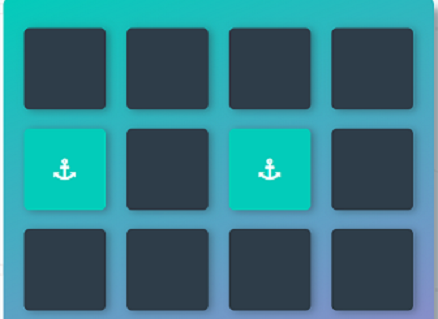

# Memory Game Project
The Memory Game Project is all about demonstrating my skills of JavaScript. I built a complete browser-based card matching game (also known as Concentration). But this isn’t just any memory game! It’s a shnazzy, well-designed, feature-packed memory game!

## Getting Started
Download the zip file or clone via Github

## Prerequisites
You will only need your browser and good internet connection.

## Table of Contents

* [How To Play](#how_to_play)
* [Instructions](#instructions)
* [Dependencies](#dependencies)
* [Contributing](#contributing)

## How To Play
* The player flips one card over to reveal its underlying symbol.
* The player then turns over a second card, trying to find the corresponding card with the same symbol.
* If the cards match, both cards stay flipped over.
* If the cards do not match, both cards are flipped face down.
* The player wins if he can match all the cards.

### A correct guess

### Incorrect guess

## Instructions

The starter project has some HTML and CSS styling to display a static version of the Memory Game project. You'll need to convert this project from a static project to an interactive one. This will require modifying the HTML and CSS files, but primarily the JavaScript file.

To get started, open `js/app.js` and start building out the app's functionality

For specific, detailed instructions, look at the project instructions in the [Udacity Classroom](https://classroom.udacity.com/me).

## Dependencies

* [Font Awsome](https://maxcdn.bootstrapcdn.com/font-awesome/4.6.1/css/font-awesome.min.css)
* [Google Fonts](https://fonts.googleapis.com/css?family=Coda)

## Contributing

This repository is the starter code for _all_ Udacity students. Therefore, we most likely will not accept pull requests.

For details, check out [CONTRIBUTING.md](CONTRIBUTING.md).
